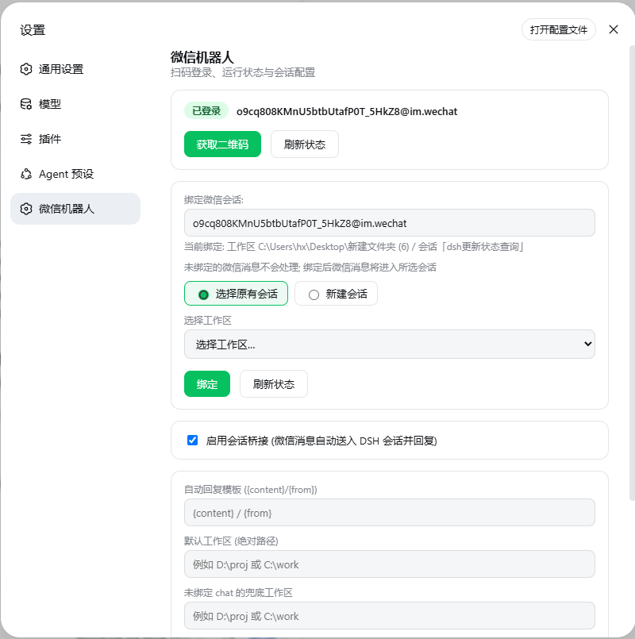
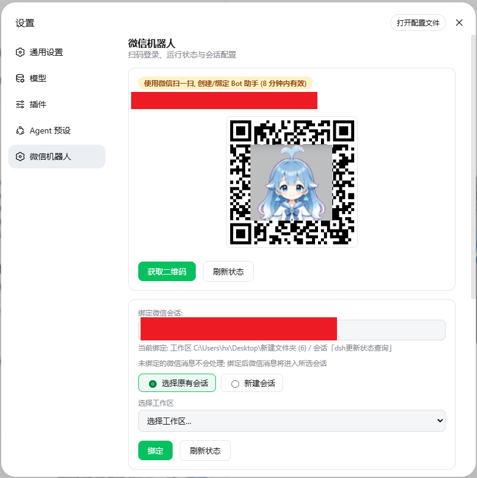

# dsh-wechat-bot

[English](./README_EN.md) · 简体中文

> **把 DSH 装进微信——人不在电脑前,也能切换工作区、切换会话、切换模型。**

基于**微信官方 iLink Bot API**(`ilinkai.weixin.qq.com`)的扫码登录机器人,纯 HTTP、零外部依赖。
微信消息直接进入你的 DSH 会话,agent 带着**完整历史上下文**回复;更妙的是,
你可以在微信里发一句**精确指令**,随时切到你 GUI 里正在聊的那场对话、那个工作区。

## ✨ 核心特色:微信就是你的「遥控器」

绑定好会话之后,你的手机从此不再只是"多一个聊天入口"——
**它就是 DSH 的随身遥控器**,工作区、会话、模型都能在微信里切换,全程不用碰电脑。

### 在微信里切换工作区 / 会话

```
你: 切换会话
Bot: 📂 请选择要切换到的会话 (回复序号或标题):
     1. 📁 proj (D:\proj) → 会话「微信助手」
     2. 📁 proj (D:\proj) → 会话「dsh更新状态查询」
     3. 📁 工作区A (C:\work) → 会话「周报」
你: 3
Bot: 📂 已选择: 工作区A (C:\work) → 会话「周报」
     切换前是否总结该会话内容? 回复「是」或「否」(回复其他内容取消)。
你: 是
Bot: ✅ 已切换: 工作区A (C:\work) → 会话「周报」
     📝 该会话内容摘要:
     · 主题: 周报整理
     · 已完成: 数据汇总表
     · 待办: 发送给领导
     之后的微信消息都会进入这个会话。
```

- **「切换会话」**:一句话列出全部工作区的所有会话 → 回复**序号或标题**,秒切
- **「切换工作区」**:先列工作区,选定后再列该工作区的会话 → 切换
- **「当前工作区」/「当前会话」**:随时查询此刻绑定在哪个工作区、哪个会话(含 id)
- 切换后绑定**持久化**,之后的微信消息都进新会话,对话记忆无缝续上
- 跨工作区的会话也能一键直达——不同项目的对话互不干扰,随叫随换

### 切换前,先让 AI 帮你「过一遍」

选好目标会话后,机器人会问一句"是否总结"——
回复「是」,**先看一遍这个会话聊了什么(主题 / 进展 / 待办),再决定要不要切**:
交接、查进度、临时切去另一个任务前,先扫一眼摘要,心里有底。

### 不止切会话:还能切换模型、新增工作区/会话

| 微信精确词 | 功能 |
|---|---|
| **切换模型** | 列出 provider/模型 → 选定后再选**推理等级**(off/high/max),per-chat 覆盖并持久化 |
| **当前模型** | 查询当前会话用的模型/推理等级(标注是会话覆盖还是全局默认) |
| **新增工作区** | 在根目录下创建同名文件夹并注册为 DSH 工作区 |
| **新增会话** | 在所选工作区创建并命名一个新会话 |
| **统计用量** | 统计当前模型对应平台的用量与余额/额度 |

```
你: 切换模型
Bot: 当前模型: deepseek-official / deepseek-v4-flash (推理等级 high)
     可用模型 (回复序号或名称):
     1. opencode-go / deepseek-v4-pro
     2. opencode-go / minimax-m3
     3. deepseek-official / deepseek-v4-flash
你: 2
Bot: 已选择 opencode-go / minimax-m3, 请选择推理等级 (off/high/max): 你选一个即可
你: max
Bot: ✅ 已切换模型: opencode-go / minimax-m3 (max)
     本次会话之后的微信消息将使用该模型。
```

> **只有精确词会触发拦截**(容忍句末标点,如"切换会话。")。共九个:
> 「切换会话」「切换工作区」「新增工作区」「新增会话」「切换模型」
> 「当前工作区」「当前会话」「当前模型」「统计用量」。
> 其他任何消息——包括"切到 xx""换到 xx"等说法——一律进入当前绑定的会话**正常聊天**,
> 不会被拦截,也不消耗额外的模型调用。
> 「切换模型」只覆盖当前微信会话(per-chat),未切换时用 DSH 全局默认模型;
> 权限模式由 DSH 全局配置控制(sandbox-policy),插件不干预。

## 其他亮点

- ✅ **官方接口**,非逆向协议,低封号风险
- ✅ 扫码创建/绑定「Bot 助手」,不需要托管个人微信号
- ✅ 免费、零外部依赖(wechaty 全家桶都不需要)
- ✅ **接续原有会话**:微信 ↔ 已存在的 DSH 会话共享同一对话历史,上下文不断档
- ✅ 微信消息与回复实时写入会话(GUI 可见),两边都能接着聊
- ✅ 会话持久化,重启 dsh 后记忆自动恢复
- ✅ GUI 内置设置页:扫码登录、状态、绑定、工作区根目录——实时生效

## 安装

**方式 1:GitHub 安装**(推荐)

```sh
dsh plugin --profile web add "github:Snowfly11531/dsh-wechat-bot"
```

> 本插件**零构建**:源码即发布产物(`lib/` 目录直接可加载),不包含 `prepare` 脚本,
> 因此 pnpm 的构建脚本白名单(`allowBuilds`)**无需配置**,安装后即可使用。

**方式 2:npm 安装**(发布后)

```sh
dsh plugin --profile web add dsh-wechat-bot
```

**方式 3:本地开发**(源码在仓库里)

```sh
git clone https://github.com/Snowfly11531/dsh-wechat-bot.git
dsh plugin --profile web add link:/absolute/path/to/dsh-wechat-bot
```

安装完成后重启 `dsh web` 生效。

## 快速开始

1. **重启 dsh web** 加载插件
2. 打开「设置 → 微信机器人」(侧边栏独立一栏,与 通用/模型/插件 并列)
3. **扫码登录**:点「获取二维码」→ 微信扫一扫 → 创建/绑定 Bot 助手(登录后 chat_id 自动识别)
4. **绑定会话**(必做,见下)——未绑定的微信消息**不会处理**,机器人会回复提示
5. 在微信里给 Bot 助手发消息 → 自动进入绑定会话并回复

> 绑定后,立刻试试微信里的 **「切换会话」**——这就是本插件最独特的地方。

### 界面预览

| 已登录 | 未登录 |
|---|---|
|  |  |

## 核心场景:把微信接进你正在聊的对话

```
① 在 DSH GUI 里和 agent 聊到一半 (比如讨论一个项目方案)
        │
② 打开「设置 → 微信机器人」→ 模式一「选择原有会话」
        │       选中刚才那个会话 → 绑定
        ▼
③ 出门在外,在微信里给机器人发消息
        │
④ agent 带着全部历史上下文回复 —— 和 GUI 里是同一个人、同一段对话
```

- 微信发来的消息会**进入该会话**,agent 的回复**同时**写入会话(GUI 里能看到)并发回微信
- 回到电脑后,在 **DSH GUI 中打开该会话还能继续聊**;之后微信再发消息,
  agent 会基于包含 GUI 新内容的上下文回复——两边记忆始终一致
- 重启 dsh 后会话自动恢复,微信继续接续,不丢任何上下文

> 提示:绑定前先在 GUI 把对话聊起来,再绑定到微信,体验最顺滑。

## 绑定会话

打开「设置 → 微信机器人」,在「绑定会话」区域选择模式:

### 模式一:选择原有会话(推荐 —— 接续已有对话)

```
[●] 选择原有会话    [○] 新建会话
chat_id:  (自动识别, 也可手动填)
工作区:   [下拉选择 ▾]
会话:     [下拉选择 ▾]   ← 显示会话标题
[绑定]
```

- **不是"新开一个对话",而是"接续"**:微信消息直接送入所选会话,
  agent 使用该会话**全部历史**(包括 GUI 里聊过的)来回复
- 按 **工作区 + 会话标题** 绑定,运行时**动态解析**——即使重启后会话 id 变化,
  只要该工作区存在同名标题的会话就能匹配
- 微信 ↔ GUI 双向接续,上下文一致(见「核心场景」)

### 模式二:新建会话

```
[○] 选择原有会话    [●] 新建会话
chat_id:  (自动识别, 也可手动填)
工作区:   [下拉选择 ▾]
新会话名称: [例如: 微信助手  ]
[绑定]
```

> ⚠️ **注意:选择「新建会话」后,会话并不会立即创建!**
> 它只在**微信里给机器人发送第一条消息时**才会在所选工作区创建,
> 并以你填的名称命名(如「微信助手」)。
> 绑定后什么都不做的话,会话列表里是看不到这个会话的——先去微信发条消息。

- 每条微信聊天对应一个**独立的新会话**(UUID,不会与其他 chat 共用)
- 创建后自动挂载到所选工作区(GUI 左侧工作区列表可见)
- 首次消息后,后续消息持续进入同一会话(对话记忆保持)

### 两种模式对比

| | 选择原有会话(推荐) | 新建会话 |
|---|---|---|
| 会话 | 复用已存在的,接续全部历史上下文 | **发第一条微信消息时才创建** |
| 记忆 | 记得 GUI 里聊过的一切 | 从零开始,之后保持 |
| 命名 | 沿用原标题 | 自定义名称 |
| 适用 | 把微信接进正在进行的对话,两头接着聊 | 想为微信开独立对话 |

## 配置

**方式 A:GUI 设置(推荐)** — 见上「快速开始」,保存后**实时生效,无需重启**。

**方式 B:编辑 `~/.dsh/profiles/web/cordis.patch.yml`**(静态配置):

```yaml
- id: wechat-bot
  name: 'dsh-wechat-bot'
  config:
    statusPath: /wechat/status   # 可选, 默认
    autoReply: ''                # 可选: 收到消息自动回复模板, 支持 {content} {from} (bridge 关闭时生效)
    emptyReply: ''               # 可选: agent 未产出文本时的兜底回复 (如 '✅ 已处理'), 留空关闭
    bridge: true                 # 可选, 默认 true: 微信消息自动送入 DSH 会话并回复
    rootDir: '~/.dsh/proj'       # 可选: 工作区根目录 (未绑定 chat 的兜底工作区 + 「新增工作区」创建位置), 默认 $DSH_HOME/proj, 无则自动创建
    bindings:                    # 可选: chat → 工作区/现有会话 的绑定
      - chatId: 'o9cq808...@im.wechat'
        workspace: 'D:\proj'     # 新建会话模式: 绑定工作区, 首次消息时创建 (可加 sessionTitle 指定名称)
      # - chatId: '...'          # 或绑定到现有会话 (复用其上下文, 接续对话)
      #   sessionId: 'session-xxx'
```

## 新增工作区 / 新增会话

都在**工作区根目录**(设置界面可改,默认 `~/.dsh/proj`,无则自动创建)下创建,并注册为 DSH 工作区。

- **设置界面**:设置 → 微信机器人 →「新增工作区」卡片,输入名称点「创建并绑定」
- **微信精确词**「新增工作区」→ 机器人询问名称 → 回复名称即创建:
- **微信精确词**「新增会话」→ 先选工作区 → 回复名称,即在所选工作区创建并命名新会话(持久化,出现在 GUI 工作区列表):

```
你: 新增工作区
Bot: 📂 请回复新工作区的名称 (将在 D:\proj 下创建同名文件夹并绑定为 DSH 工作区):
你: 我的项目
Bot: ✅ 新增工作区成功: D:\proj\我的项目
     已绑定为 DSH 工作区, 可在工作区列表/绑定会话中看到。
```

> 名称不能含 `\ / : * ? " < > |` 等非法字符;目标目录已存在时会直接注册为工作区(不覆盖内容)。

> 创建会话时自动应用 DSH 默认 agent preset(设置 → 模式,如「梁神模式」),确保 bash/文件等工具可用;
> 若默认 preset 在该电脑上不存在(如其他电脑未装自定义模式),自动回退 DSH 内置「标准模式」;
> 修复前创建的旧会话若没有工具,可在 GUI 打开该会话 → 会话设置中选择模式即可。微信桥接自动新建的会话同样自动应用。

## 微信语音输入(🎤)

收到微信语音消息,自动转成文字再送入对话:

```
你: (发一条语音)
Bot: (把语音转成文字) ✅ 收到: [语音转文字] 明天开会记得带电脑
```

- **服务端转写优先**:语音消息自带 `text`(微信已转写)时直接用,零成本即时
- 无自带文本时,调用下方**语音识别模型**接口转写
- 转写失败会回复提示原因,不会丢消息

**配置**(设置 → 微信机器人 →「语音输入」卡片,保存即生效):

| 配置 | 默认 | 说明 |
|---|---|---|
| 启用语音输入 | ✅ | 关闭后语音消息不进入对话 |
| 语音识别模型 | `mimo-v2.5-asr` | 传给识别接口的 model id |
| 语音识别接口 | `https://api.xiaomimimo.com/v1` | OpenAI 兼容 base URL,接口为 `/chat/completions` |
| 识别 key | `XIAOMI_API_KEY` | DSH 凭据里的 key 引用名(默认即 DSH 的 mimo key) |
| 语种 | `auto` | `auto` / `zh` / `en` |

> 语音默认经 AES-128-ECB 解密后以原始编码(通常 SILK)送识别;若所用识别模型不接受该编码,优先使用服务端自带转写文本。
> 语音识别为远程 API 调用,可能产生费用与延迟。

## 会话桥接说明

- **未绑定**:微信消息不处理,机器人回复"请先在设置中绑定会话"
- **已绑定**:微信消息进入绑定会话,agent 回复发回微信,消息同时写入 DSH 会话(GUI 可见)
- **接续**:绑定「原有会话」时,微信消息基于会话全部历史回复——GUI 里聊过什么,agent 都记得;
  在 GUI 中继续发消息也会进入同一会话上下文,之后微信再发消息时 agent 会基于最新上下文回复
- 会话持久化,重启 dsh 后自动恢复,微信继续接续
- 配置 `bridge: false` 可关闭桥接(仅收发,不驱动 agent)

## 工具

| 工具 | 说明 |
| --- | --- |
| `wechat_status` | 查询登录状态 / 二维码是否就绪 |
| `wechat_send` | 给 chat_id 发文本(chat_id 来自 inbox) |
| `wechat_read_inbox` | 读取收到的最近 200 条消息 |
| `wechat_sessions` | 列出可选会话(id + 工作目录) |
| `wechat_bind` | 把 chat_id 绑到指定 workspace 或 sessionId |

## 凭据位置

登录成功后 token 保存在 `~/.dsh/data/dsh-wechat-bot/accounts/<bot_id>.json`。

## License

MIT
